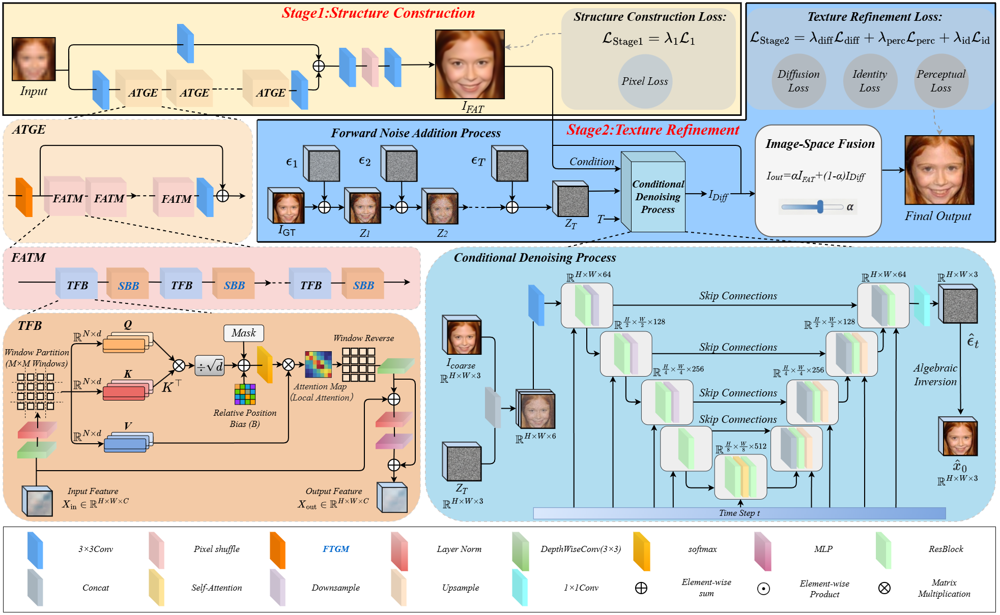
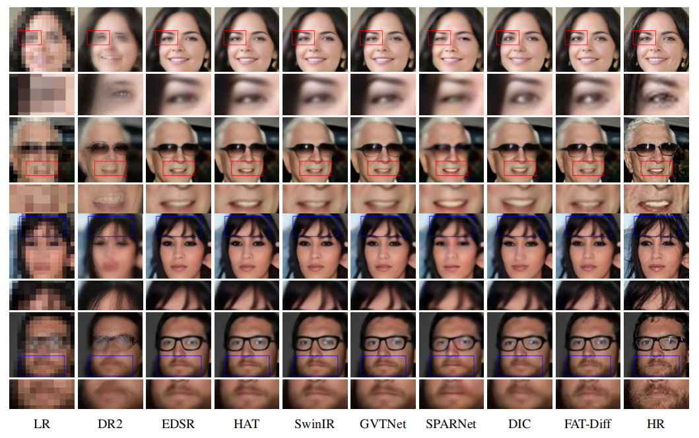

# FAT-Diff: Decoupling Structural Topology and Generative Realism for Extreme Face Super-Resolution

Official PyTorch implementation of FAT-Diff, a two-stage framework for extreme face super-resolution that decouples structural topology recovery and generative detail enhancement.

> 🚧 **Status:** Under Review
>
> 💻 **Source Code:** To be released upon acceptance
>
> 📦 **Pretrained Models:** To be released upon acceptance

---

## 🚀 News

- **[2026-06]** FAT-Diff repository initialized.
- **[2026-06]** Paper submitted to *IEEE Transactions on Image Processing (TIP)*.
- **[Coming Soon]** Source code will be released upon acceptance.
- **[Coming Soon]** Pretrained models will be released upon acceptance.

---

## 🏗️ Framework

### Stage I: Facial Topology-Aware Structure Construction

FAT-Net leverages graph-based attention mechanisms guided by the proposed Facial Topology Guidance Matrix (FTGM) to recover global facial structures from severely degraded inputs.

### Stage II: Diffusion-based Texture Refinement

A diffusion refinement network further restores high-frequency facial details and improves perceptual realism while maintaining identity consistency.

  

**Figure 1.** Overall architecture of the proposed FAT-Diff framework.

---

## 📦 Dataset Preparation

### Datasets

The experiments are conducted on the **CelebA** and **Helen** face datasets.

* **CelebA** is used for training and quantitative evaluation.
* **Helen** is used to evaluate the generalization capability of the proposed method on unseen facial images.

### Face Alignment and Cropping

Following common face super-resolution protocols, all face images are first aligned using facial landmarks and then center-cropped to obtain normalized facial regions.

---

## 📊Experimental Results

FAT-Diff achieves competitive performance on multiple face super-resolution benchmarks and demonstrates strong reconstruction capability under extreme low-resolution settings.

Representative visual results are provided below.

  

**Figure 2.** Visual comparison on extreme face super-resolution. Zoomed-in facial regions are provided for detailed inspection. **Rows 1–2** correspond to the eye and mouth regions, while **Rows 3–4** correspond to the hair and beard regions. Our FAT-Diff reconstructs more accurate facial geometry and preserves richer high-frequency textures, leading to superior visual quality compared with existing approaches.

---

## 🙏 Acknowledgement

This project is built upon several excellent open-source projects, including:

* BasicSR
* SwinIR
* GVTNet
* DDIM

We sincerely thank the authors for making their code publicly available.

---

## 🛠️ Requirements

- torch>=1.13
- torchvision>=0.14
- opencv-python>=4.5
- (See [requirements.txt](requirements.txt) for full dependencies)

---

## 📜 License

This project is released for academic research purposes only.

See the LICENSE[LICENSE](LICENSE) file for details.
